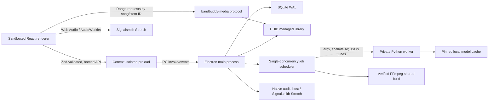

# BandBuddy desktop architecture

## Process boundary

主进程独占数据库、路径、对话框、任务、子进程、托盘和通知。renderer 禁用 Node 集成，不能获得分轨绝对路径；`bandbuddy-media://song/<song-id>/stem/<stem-id>` 只通过数据库 ID 解析受管资源并支持 Range。

Preload 只暴露命名后的曲库、任务、运行环境、设置、媒体、录音、排练、导出与窗口控制 API。每个入参在 main 侧再次由 Zod 校验，IPC sender 必须是当前主窗口 main frame，开发态要求精确 origin，生产态要求精确 renderer 文件。Debug 模式开启后，renderer/preload 生命周期、IPC 耗时和进程异常会写入单独的脱敏 `debug.log`；常规运行日志仍写入 `bandbuddy.log`。

## Persistence and atomicity

SQLite 启用 WAL、foreign keys 与 busy timeout。迁移前复制数据库，按时间只保留三份。持久化内容包括歌曲与分轨、练习状态、录音轨与 Take、排练编排/修订/录音、任务和设置。歌曲调分析保存置信度、候选与分段结果；手动纠正单独标记，重新分析不会覆盖。练习状态和录音 Take 都记录升降调半音数，排练时间线指纹也包含升降调，避免旧 Take 被错误套用到新的时间关系。

处理结果先写 `<song>/.tasks/<job>/prepared`。六轨全部可探测、标准化并生成 peaks 后，目录才原子 rename 到 `versions/<uuid>`，最后事务切换 active separation；重分离失败时旧版本仍可用。启动时把未完成活动任务标为 `interrupted`，排队任务保留。

## Audio pipeline

内部音频统一为 44.1 kHz、stereo、24-bit FLAC。播放器为六个受控 `HTMLAudioElement`，经各自 MediaElementAudioSource 和 GainNode 汇入 master。Mute 优先于 Solo；存在任意未静音 Solo 时只播放这些 Solo。增益使用短斜坡，主轨时钟定期修正其余音轨漂移。

非鼓分轨通过 Signalsmith Stretch AudioWorklet 实时做 `-12–+12` 半音变调，鼓轨与录音 Take 走不变调旁路，并按处理器报告的延迟统一补偿；干湿切换使用短交叉淡化。AudioWorklet 初始化失败时回到原调并通知界面。排练播放器串行准备歌曲，恢复播放前等待当前加载完成，并把同一处理延迟应用到排练录音叠加层。

原生音频宿主负责 WASAPI/CoreAudio/ASIO 录音，也提供离线 Signalsmith WAV 变调命令。录音 Take 绑定录制时的速度和升降调；预听、排练叠加与导出只使用与当前练习设置一致的 Take。启动时 renderer 会同时核对 Web Audio 输出设备与原生录音设备，失效的显式选择回到当前系统默认值。

WaveSurfer 只绘制后台生成的 min/max peaks，不拥有播放时钟。六轨共享游标、缩放、滚动和 A–B 区间。练习状态 500 ms 防抖保存，播放中每 5 秒以及隐藏/页面切换时立即保存。

## Runtime and worker protocol

`worker.py` 每行输出一个含 `protocol: 1` 的 JSON 对象，类型为 `progress`、`result` 或 `error`。工作进程没有 HTTP 端口，不经过 shell。父进程取消任务时终止子进程并清理 `.tasks` 临时目录。

模型下载 marker 记录 repo、revision、哈希与文件绝对位置；每次加载再次校验文件仍位于 model root 且 SHA-256 相符。CUDA 选择需要 `nvidia-smi`、Torch `cuda.is_available()` 和张量自检共同通过。

## Export

标准分轨导出不应用练习增益，但会把当前升降调应用到所有非鼓分轨；鼓轨保持原音。当前混音只选可听轨，先把非鼓轨合成并通过原生 Signalsmith 变调，再与延迟对齐的鼓轨及匹配当前速度/调性的录音 Take 混合；可选 `atrim`/A–B、`atempo`/当前速度，最后用透明峰值 limiter 防削波。输出先写同目录 `.part` 文件，成功后 rename；临时变调总线完成后删除，所有子进程路径始终作为 argv 元素传递。
