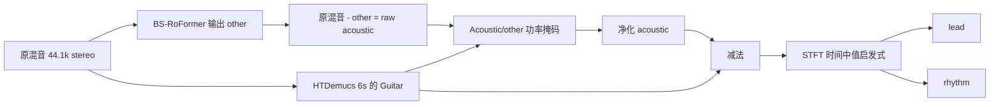
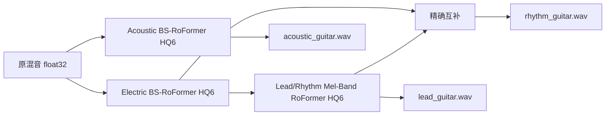

# BD Guitar Separator V14.5.0 逆向与 HQ6 三轨实现

日期：2026-09-03。结论先行：V14.5.0 的木吉他部分使用公开 BS-RoFormer，电吉他由 Demucs 总吉他减去处理后的木吉他得到，主音/节奏并没有专门模型，而是 STFT 时间中值启发式。该启发式在目标歌曲上会把大量节奏瞬态分给主音。最终实现因此保留并升级木吉他模型链路，换成直接电吉他模型，再用受监督 Lead/Rhythm Mel-Band RoFormer 做第二级分离；只实现固定 HQ6。实验阶段曾生成去除轨用于浮点重建审计；BandBuddy 2.0 生产链路只保存三个独立吉他轨，去除版由静音和混音导出得到。

## 样本与方法

| 项目 | 值 |
|---|---|
| Windows EXE | `BDGuitarSeparator.exe`，64,215,716 bytes |
| EXE SHA-256 | `fc88401ff6df408367ddfa44b60c4e21193dab6de6c63cd3f3eff730d29aba74` |
| 内部构建标识 | V14.5.0，`20260901-141011` |
| macOS 参考包 | `BD吉他分离器-Mac-AppleSilicon-V14.5.0.dmg`，503,571,916 bytes |
| DMG SHA-256 | `2c48ebf5a6ccd4e634c1f3fcb7bbdfceb6e42bd5bc386b2cc322795071d396ad` |
| 测试歌曲 | `新裤子 - 没有理想的人不伤心.mp3` |
| 输入 SHA-256 | `c3cd8b471b422db2f424ad651246c23ad1827ea28293e0ad3d5eca6594b34177` |
| 输入媒体 | MP3，44.1 kHz stereo，341.053333 s |

分析对原目录只读：确认 PyInstaller onedir 布局，提取其 PYZ 模块，反汇编 `app`、`offline_runtime` 和 `separator_core` 的 Python 3.12 bytecode，并在硬链接镜像中做导入/模型加载验证。Windows 包已包含足够的完整逻辑、配置和相同公开权重，因此没有再挂载 DMG；DMG 只做了尺寸和哈希留档。

## V14.5.0 实际运行环境

| 组件 | 版本/值 |
|---|---|
| Python | 3.12，PyInstaller onedir |
| PyTorch | `2.13.0+cu132` |
| CUDA runtime | 13.2 |
| `audio-separator` | 0.47.0 |
| NumPy | 2.5.2 |
| librosa | 1.0.0 |
| soundfile | 0.14.0 |
| 采样率/声道 | 44,100 Hz / stereo |

`audio-separator` 的相应公开版本可在 [v0.47.0 release](https://github.com/nomadkaraoke/python-audio-separator/releases/tag/v0.47.0) 核对；Demucs 的模型定义和推理入口来自其[官方仓库](https://github.com/facebookresearch/demucs)。

## 原软件到底怎样分三类吉他



### 1. 解码和木吉他模型

- FFmpeg 解码为 44.1 kHz、双声道、float WAV；少于 563,200 帧时补零。
- checkpoint `bs_roformer_acoustic_guitar.ckpt` 的 SHA-256 为 `fa386b...2b3e`，与公开的 `bs_mega_53stem_acoustic-guitar_mvsep.ckpt` 逐字节一致。
- BS-RoFormer：`dim=256`、`depth=12`、8 heads、62 个频带、STFT 2048 / hop 512、stereo、单目标，38,692,876 个参数。checkpoint 有 699 个 tensor、38,693,580 个 tensor values，主要权重为 FP16。
- 应用要求 `audio-separator` 返回 `other`，然后用未归一化参考混音减去该 residual 重建 raw acoustic。
- `audio-separator 0.47.0` 在这条兼容路径实际按 `512 × (1101 - 1) = 563,200` samples（12.771 s）分块，而配置中供官方 MSST 推理使用的是 882,000 samples（20 s）。所谓“最高音质”把 overlap 设为 2；窗口是 Hamming overlap-add，CUDA AMP 开启。

### 2. 总吉他和木吉他净化

- `htdemucs_6s.yaml` 指向官方模型 ID `5c90dfd2`；本地权重 `5c90dfd2-34c22ccb.th` 的完整 SHA-256 是 `34c22ccb381c6f9fdbf324f04e1e2fe21aaaf293f5ded163a162697ff9a02ddd`。
- 模型是单个 HTDemucs，27,414,996 参数，输出 `drums/bass/other/vocals/guitar/piano`；44.1 kHz stereo，segment 7.8 s，STFT 4096 / hop 1024，48 channels、depth 4、Transformer 5 层/8 heads/dropout 0.02。
- 应用只保留 `Guitar`。Demucs 推理用 `shifts=1`、`overlap=0.1`、FP32 CUDA。GUI 虽把“高质量”映射到全局 `SHIFTS=2`，这条 remove-electric 分支又把 Demucs shifts 限制为 1；高质量设置实际只增加了前一阶段的 RoFormer overlap。
- 应用不是直接采用 raw acoustic，而是每声道 STFT 2048 / hop 512，用 acoustic 和 residual 的功率形成掩码：

  `mask = (|A|² / (|A|² + |R|² + 1e-10))^1.5`

  再以 `ISTFT(STFT(total_guitar) × mask)` 得到净化木吉他。处理块为 20 s，相邻块交叉淡化 0.25 s。
- 电吉他为 `total_guitar - purified_acoustic`。

### 3. 主音/节奏不是模型

原包没有 Lead/Rhythm checkpoint。它对电吉他逐声道做 STFT 2048 / hop 512：

```text
background = median(abs(S), axis=time)
foreground = max(abs(S) - background, 0)
lead_mask = foreground / (foreground + background + 1e-8)
lead = ISTFT(S * lead_mask)
rhythm = electric - lead
```

因此它实际分的是“相对时间中值更瞬态”与“持续谱背景”，并不知道演奏角色。15 秒对照片段中，原启发式的 lead RMS 为 0.05573、rhythm RMS 为 0.03339；受监督 Lead/Rhythm 模型在同一电吉他输入上的 lead RMS 只有 0.00385，说明原规则在非独奏段把大量节奏成分推入了 lead。

### 4. 原链路的额外音质损失

- `audio-separator` 的 `normalize()` 会在 peak > 0.9 时改变输入幅度，但该应用在“未归一化参考 - 模型 residual”前没有恢复该增益，可能把非目标内容写进木吉他。
- `CommonSeparator` 经 pydub 写中间 WAV 时转为 int16，模型阶段之间发生一次不必要量化。
- GUI 的最终有损出口固定为 320 kbps MP3。
- 主音/节奏启发式不是语义模型，这是最大结构性问题。

## 为什么最终只选这条链路



只保留一个策略 `guitar-hq6-2026-09-03`：

- 木吉他和电吉他都从原混音进入各自的专用 BS-RoFormer，避免“总吉他减木吉他”传播两级误差。
- Lead/Rhythm 模型只看已经隔离的电吉他，构成两级语义分离；MVSep 的公开 API 页面也把 Lead/Rhythm 的 two-stage 方案列为默认并报告 SDR 9.21，高于 one-stage 的 9.02。该数值是网站给其算法的指标，不是本歌曲的真值评分，见 [MVSep Full API](https://mvsep.com/en/full_api)。
- rhythm 始终是 `electric - lead`，保持两轨混合一致性。
- 实验审计中的三个去除结果严格定义为 `decoded_input_mix - isolated_stem`，用于证明浮点重建；生产任务不再落盘这些冗余文件。
- 三种等变 TTA（identity、channel swap、polarity）× 2 个 half-track circular big shift，共 6 passes；这是官方 MSST `apply_tta` 和 `bigshifts_wrapper` 的组合方式。模型结构代码固定到 [MSST commit `0e5f115`](https://github.com/ZFTurbo/Music-Source-Separation-Training/commit/0e5f1159fc5ea87fc13b957584e178b4977e5dd3)。
- 不提供较低 overlap、单 pass、启发式或有损导出的开关。

### 最终模型锁定

| 阶段 | 模型与 repository revision | 架构/关键推理 | 参数 | checkpoint SHA-256 |
|---|---|---|---:|---|
| 木吉他 | Mega 53-stem acoustic；`0677941f...` | BS-RoFormer；20 s；overlap 2；HQ6；AMP | 38,692,876 | `fa386b2e...2b3e` |
| 电吉他 | Mega 53-stem electric；`0677941f...` | BS-RoFormer；20 s；overlap 2；HQ6；AMP | 38,692,876 | `cd506bfce...553d` |
| 主音 | `listra92` Lead/Rhythm；`46ca65d5...` | Mel-Band RoFormer；3 s；overlap 2；HQ6；AMP | 84,199,748 | `b3c47bca...7eef` |
| 节奏 | 无额外模型 | `electric - lead`，float32 | — | — |

Mega 53-stem 的公开文件在 [Hugging Face 模型树](https://huggingface.co/noblebarkrr/BS-Roformer-MVSep-Mega-53-stems/tree/main/v1)；Lead/Rhythm 文件和配置索引在 [`mvsepless_resources/models.json`](https://huggingface.co/noblebarkrr/mvsepless_resources/blob/main/models.json)。实现固定的是表中 commit revision，而不是会移动的 `main`。

候选实测结果支持这个选择：

| 对照（15 s，单 pass） | 观察 |
|---|---|
| 通用 guitar BS-RoFormer vs 原包 Demucs Guitar | 相关系数 0.9283 |
| 直接 electric BS-RoFormer vs 原包 Demucs Guitar | 相关系数 0.8747；两者目标定义不同 |
| `generic guitar - acoustic` vs direct electric | 相关系数 0.99596，差分能量约 -20.05 dB |
| `acoustic + electric` vs generic guitar | 相关系数 0.99756 |
| `Demucs guitar - acoustic` vs direct electric | 相关系数 0.8846 |
| MBR Lead vs 专用两输出 HTDemucs Lead（整曲） | 相关系数 0.92766；两者都定位 230–270 s 独奏，MBR 在非独奏段更克制 |

没有真值 stems 时，相关性不能当作 SDR；它只用于排除明显不一致的链路。最终采用 MBR 还因为它的 Rhythm 可以用精确 residual 构造，而候选 HTDemucs 的两输出在实测中相加对输入仍有约 -24 dB 的重建误差。

## 指定歌曲的最终 HQ6 结果

实测环境：Windows、Python 3.12.10、公开官方 `torch 2.11.0+cu130`、CUDA 13.0、RTX 3060 Laptop 6 GiB。总耗时 864.91 s。

| 阶段 | 6-pass 推理 | CUDA peak allocated |
|---|---:|---:|
| 木吉他 BS-RoFormer | 320.65 s | 1,140,857,856 bytes |
| 电吉他 BS-RoFormer | 336.37 s | 1,140,857,856 bytes |
| Lead/Rhythm MBR | 201.16 s | 551,585,792 bytes |

当时用于算法选型的六个审计成品都是 15,040,452 帧、341.053333 s、44.1 kHz、stereo、IEEE float32 WAV；其中三个 `without_*` 仅为历史实验产物，不属于 2.0 输出合同：

| 输出 | peak | RMS | SHA-256 |
|---|---:|---:|---|
| acoustic | 0.467160 | 0.047739 | `36415c29b0e9b9188d1f940dd513ed749bc06cd6bf5e1a93882933a07d5fb8cf` |
| lead | 0.616911 | 0.046856 | `9c385aa52f6f830c0f0bc3b9b275514e438d39dabfc296b7e1549b56c47fe1c7` |
| rhythm | 0.796310 | 0.117246 | `89b0396c05095c8ae3189df2643bba83ea6929cc0558c7f5bae64e078374f7a5` |
| without acoustic | 1.051079 | 0.275885 | `a8a6b5499f9fae2127664266feee6e8a4890f7960cebc2f56394c9925c7b71e6` |
| without lead | 1.168946 | 0.283590 | `0bdbe5f50b15475b9bef98aef2fe31165d08730ce872ce00232327081bf0176e` |
| without rhythm | 1.213426 | 0.241731 | `5b01e6c6c9237e02d3f01a8f33ebf826c28f0a192905cc4a402d9672eaecd0e3` |

磁盘重读验证通过：六个文件均无 NaN/Inf；三个独立轨无样本达到或超过 ±1。内存中 `lead + rhythm - electric` 的 RMS 为 `2.97e-9`、peak 为 `2.98e-8`。三个去除结果与对应独立轨重建原混音的 peak 误差均为 `5.96e-8`，RMS 为 `2.25e-9` 至 `5.48e-9`。每 10 秒的能量检查把 250–260、240–250、260–270、230–240 s 排为最强主音区，主音相对电吉他分别为 -3.22、-3.79、-5.02、-6.51 dB；270 s 后立刻回到 -33 dB，符合歌曲独奏段的结构，而不是把整段节奏吉他持续送进 lead。

三个严格去除残差的 sample peak 为 1.0511、1.1689、1.2134（约 +0.43、+1.36、+1.68 dBFS）。IEEE float32 WAV 完整保留这些值，没有发生文件削波；若播放器或后续定点出口会在 0 dBFS 硬削波，应分别降低约 0.5、1.4、1.7 dB 试听，而不是改写审计母版。

这证明格式、数值守恒和宏观段落定位；由于没有该商业录音的真实三轨，不能诚实地给出本歌曲 SDR，也不能以能量统计代替最终盲听。成品旁的 `quality_report.json` 保留了全部 10 秒窗口和六文件复验结果。

## 实现与复跑

- 入口：[`python/guitar_separator_hq_cli.py`](../../python/guitar_separator_hq_cli.py)
- 固定模型与哈希：[`python/guitar_separator_hq/specs.py`](../../python/guitar_separator_hq/specs.py)
- HQ6 推理：[`python/guitar_separator_hq/inference.py`](../../python/guitar_separator_hq/inference.py)
- 下载/校验：[`python/guitar_separator_hq/model_store.py`](../../python/guitar_separator_hq/model_store.py)
- 三轨编排与 manifest：[`python/guitar_separator_hq/separator.py`](../../python/guitar_separator_hq/separator.py)
- 独立磁盘 QA：[`python/guitar_separator_hq/verify.py`](../../python/guitar_separator_hq/verify.py)
- 运行说明：[`python/guitar_separator_hq/README.md`](../../python/guitar_separator_hq/README.md)

权重不提交到源码或安装包。BandBuddy 2.0 从公开的 [ModelScope `Zzzzzzorz/BandBuddy-Models`](https://modelscope.cn/models/Zzzzzzorz/BandBuddy-Models) 固定 `v2.0.0` 分支下载四文件包并校验；该仓库按 GPL-3.0 发布，保留来源和第三方声明。MSST 架构代码是 MIT，项目已保留对应许可证。PyTorch 2.13 的 CUDA 13.2 wheel 同样存在于[官方 wheel 索引](https://download.pytorch.org/whl/cu132/torch/)；原包版本与本次独立实测版本已分别记录，不把两者混写。
