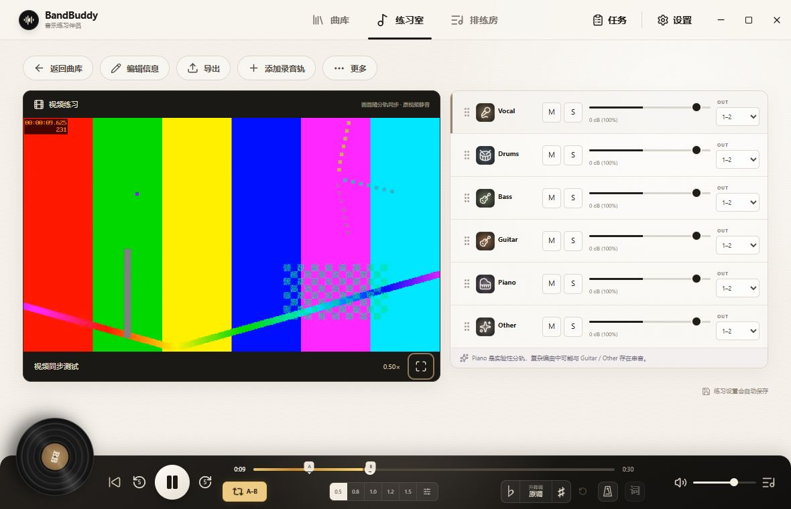
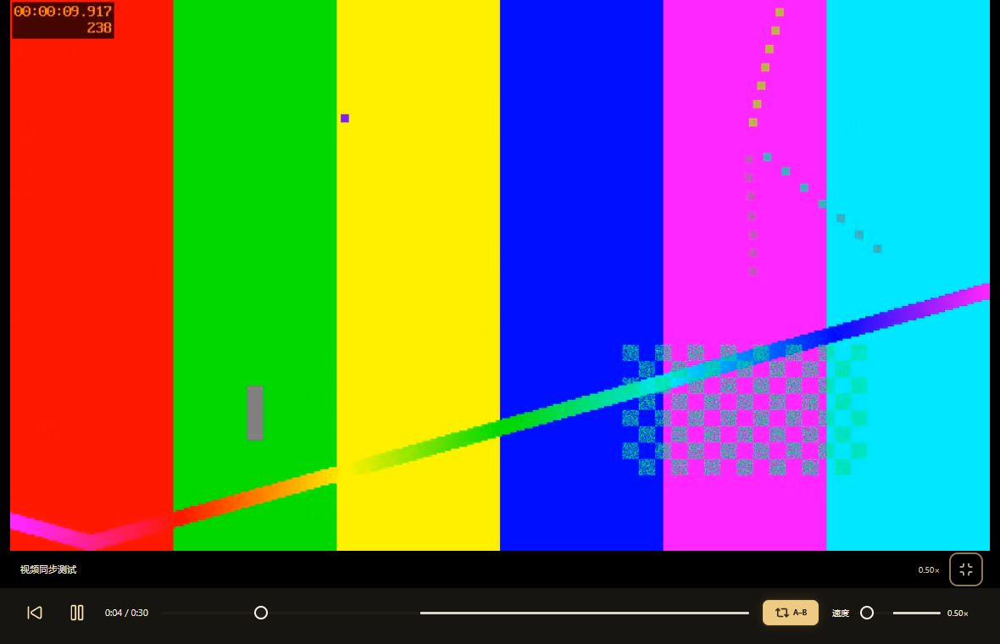

# BandBuddy 1.3.0 验证记录

验证日期：2026-09-01。环境：Windows x64、Electron 43.1.1、本地固定版本 FFmpeg，以及 Codex 内置浏览器。测试使用生成的视频与音频、临时曲库，没有读写实际用户曲库。

| 范围 | 结果 |
| --- | --- |
| 视频导入与处理 | 真实 FFmpeg 验证 MPEG-4 AVI 提取音频并转换为 VP9；H.264 MP4 重封装后画面数据逐包哈希一致，播放副本无音轨；VP8 重封装和音频延迟 0.3 秒的时间轴对齐通过。 |
| 曲库与资源 | 原文件复制、重复检测、六轨标准化、peaks 生成、重新分轨复用视频、视频 Range 请求、非法资源路径拒绝，以及旧数据库迁移后保留练习状态均通过。 |
| 视频播放 | 本地 30 秒实际媒体可播放；视频静音，随分轨暂停、跳转和循环；浏览器验证 0.5×、1.5× 速度与 video.playbackRate 一致。 |
| 单键 A–B | 设置 A、设置 B 后自动从 A 播放、取消循环通过；无效 B 点有提示；B 位于歌曲末尾时仍能循环。 |
| 跳回继续播放 | 循环中回到 A，未循环时回到 0；暂停时自动播放，不重复预备拍；Home 快捷键与连续快速跳回的并发回归通过。 |
| 全屏与布局 | 进入和退出全屏、全屏播放/暂停/跳回/取消循环通过；视频视图没有分轨波形，但保留六轨混音控制。1440×960 和最小窗口 1180×760 均检查。 |
| 音频兼容 | 纯音频歌曲仍呈现六轨波形视图，单键循环和跳回可以使用；本轮浏览器测试没有新增 renderer 警告或错误。 |
| 全量验证 | 37 个测试文件、156 项测试全部通过；类型检查、资源校验、生产构建、原生音频模块自检通过。 |
| Windows 打包 | 安装版与便携版生成成功；解包后的真实程序用隔离数据目录启动，退出码 0，预加载 API、曲库、FFmpeg 和桌面歌词检查通过。 |

执行命令：

```powershell
pnpm test
pnpm build
pnpm native:audio
pnpm exec electron-builder --config electron-builder.unsigned.yml --config.directories.output=release-unsigned/v1.3.0 --win nsis portable --x64
```

打包启动测试使用程序已有的 `BANDBUDDY_SMOKE=1` 与临时 `BANDBUDDY_TEST_ROOT`，运行 `win-unpacked/BandBuddy.exe`。隔离环境未安装 Demucs，返回 `runtime: missing` 符合预期；`ffmpegReady: true`、`desktopLyrics: true`。两份 EXE 均为未签名构建，SHA-256 校验值在对应输出目录的 `SHA256SUMS.txt`。

验证边界：分轨集成测试以替身 worker 返回提取后的 WAV，实际执行前后的 FFmpeg 和数据库流程，本轮未重新运行完整 Demucs 模型推理。浏览器使用隔离的曲库接口夹具与真实媒体；全屏滑块的进度和速度回调由组件测试覆盖，浏览器中实测的是速度预设按钮。本轮未验证 macOS 包、长视频转码性能或外置 ASIO 声卡。打包启动测试退出时记录了两条 Chromium GPU 日志，启动检查与退出码正常，未进行多显卡兼容测试。

最小窗口中的视频与六轨混音控制（测试图案）：



全屏视频及播放、进度、循环和速度控制（测试图案）：


